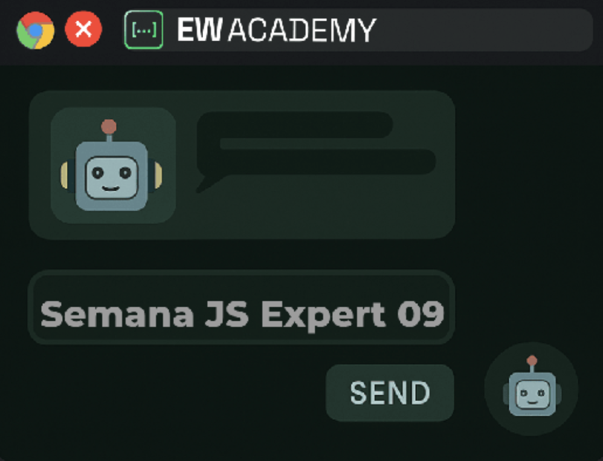

<div  align="center" id="about">
	<h1 align="center">
        JS Expert Week 9
    </h1>
    <p align="center">
        The project was developed during JS Expert Week by EW Academy with the purpose of exploring the principles of Web 4.0. It showcases how to build and run an intelligent AI-powered chatbot application directly in the browser, capable of delivering complete and context-aware responses. In addition to general interactions, the chatbot is also designed to fetch, respond, and translate information from my personal GitHub profile, making the experience more dynamic and personalized. The main goal is to provide a practical learning experience on implementing modern conversational interfaces by combining cutting-edge web technologies with artificial intelligence for seamless, real-time interactions.
    </p>
	
</div>
<br>
<div align="center">
    <a href="https://github.com/nodejs" target="_blank"></a>
    <a href="https://github.com/arturbomtempo-dev/js-expert-9.0" target="_blank"></a>
    <a href="https://github.com/arturbomtempo-dev/js-expert-9.0" target="_blank"></a>
    <a href="https://github.com/arturbomtempo-dev/js-expert-9.0/blob/main/LICENSE.md" target="_blank"></a>
</div>

<div id="table-of-contents"></div>

## 📋 Table of Contents

- [About](#about)
- [Table of Contents](#table-of-contents)
- [Features](#features)
- [Application Demonstration](#application-demonstration)
- [Setup and Run the Application](#setup-and-run-the-application)
- [Technologies](#technologies)
- [Author](#author)
- [License](#license)

<div id="features"></div>

## 📝 Features

All the core functionalities listed below have been fully developed and are functional. However, since this project was created primarily for educational purposes, some advanced features were not implemented yet and currently have no defined timeline. The following list highlights which features are already available and which ones are still planned for future development.

- [x] Automated message responses
- [x] Real-time interaction with artificial intelligence directly in the browser
- [x] Execution of responses in real time
- [x] Ability to stop or abort a response on demand
- [ ] Multi-browser support (cross-browser compatibility)
- [ ] Extended customization options for chatbot behavior
- [ ] Advanced session management and persistence
- [ ] Integration with external APIs for enhanced responses

<div id="application-demonstration"></div>

## 📲 Application Demonstration

Below, you will find demonstration image of the application in action, showcasing the chatbot interface, its integration with artificial intelligence, and how it connects to the underlying database to provide accurate and dynamic responses. These examples highlight real conversations, including the ability to translate and respond to information retrieved from my personal GitHub profile.

- Chatbot responding to a user message with AI assistance


<div id="setup-and-run-the-application"></div>

## 📁 Setup and Run the Application

### ⚙️ Prerequisites

Before starting, you need to have the following tools installed on your machine: [Git](https://git-scm.com) and [Node.js](https://nodejs.org/en).

It’s also recommended to use a code editor like [Visual Studio Code](https://code.visualstudio.com/).

> **Important:** At this stage, the application only runs on **Google Chrome**, since the AI features rely on experimental browser APIs that are not yet available in other browsers.

#### Configure Google Chrome

To enable AI features in the browser:

1. Open Google Chrome and access `chrome://flags/`.
2. Enable the following experimental flags:
    - **Prompt API for Gemini Nano**
    - **Prompt API for Gemini Nano with Multimodal Input**
3. Open the browser console and run the following command to start a session with the local language model:

```javascript
const session = await LanguageModel.create({
    monitor(m) {
        m.addEventListener('downloadprogress', (e) => {
            console.log(`Downloaded ${e.loaded * 100}%`);
        });
    },
});
```

**What this does:** This command initializes a new AI session in your browser and monitors the model download progress.

4. Verify that the model has been fully downloaded by visiting:

```plaintext
chrome://on-device-internals/
```

#### Run the Application

Once the browser is configured, follow the steps below to run the project locally:

```bash
# Clone this repository
git clone https://github.com/arturbomtempo-dev/js-expert-9.0.git

# Navigate to the project folder
cd js-expert-9.0

# Install dependencies
npm install

# Start the application
npm start
```

The application will run in development mode and can be accessed directly in your Google Chrome browser.

<div id="technologies"></div>

## 💻 Technologies

The following tools and frameworks were used in the development of this project:

- [**HTML**](https://developer.mozilla.org/docs/Web/HTML): Used to structure the application’s interface and organize the chatbot layout directly in the browser.
- [**CSS**](https://developer.mozilla.org/docs/Web/CSS): Responsible for styling the interface, making the chatbot visually clean, responsive, and user-friendly.
- [**JavaScript**](https://developer.mozilla.org/docs/Web/JavaScript): Core programming language that adds interactivity, handles chatbot logic, and manages communication with the AI model.
- [**Node.js**](https://nodejs.org/en): Provides the runtime environment to run JavaScript outside the browser, enabling the project to be executed locally through npm scripts.
- [**browser-sync**](https://browsersync.io/docs): Used as a development tool to automatically refresh the browser whenever changes are made to the code, ensuring faster and smoother testing.

<div id="author"></div>

## 👨🏻‍💻 Author

---

| [<br><sub>Artur Bomtempo</sub>](https://arturbomtempo.dev/) |
| :--------------------------------------------------------------------------------------------------------------------------------------------------: |

Developed by Artur Bomtempo 👋🏻. Get in touch:

[](mailto:arturbcolen@gmail.com)
[](https://www.linkedin.com/in/artur-bomtempo/)
[](https://www.instagram.com/arturbomtempo.dev/)

<div id="license"></div>

## 📜 License

Copyright (c) 2025 Artur Bomtempo Colen

Permission is hereby granted, free of charge, to any person obtaining a copy
of this software and associated documentation files (the "Software"), to deal
in the Software without restriction, including without limitation the rights
to use, copy, modify, merge, publish, distribute, sublicense, and/or sell
copies of the Software, and to permit persons to whom the Software is
furnished to do so, subject to the following conditions:

The above copyright notice and this permission notice shall be included in all
copies or substantial portions of the Software.

THE SOFTWARE IS PROVIDED "AS IS", WITHOUT WARRANTY OF ANY KIND, EXPRESS OR
IMPLIED, INCLUDING BUT NOT LIMITED TO THE WARRANTIES OF MERCHANTABILITY,
FITNESS FOR A PARTICULAR PURPOSE AND NONINFRINGEMENT. IN NO EVENT SHALL THE
AUTHORS OR COPYRIGHT HOLDERS BE LIABLE FOR ANY CLAIM, DAMAGES OR OTHER
LIABILITY, WHETHER IN AN ACTION OF CONTRACT, TORT OR OTHERWISE, ARISING FROM,
OUT OF OR IN CONNECTION WITH THE SOFTWARE OR THE USE OR OTHER DEALINGS IN THE
SOFTWARE.
